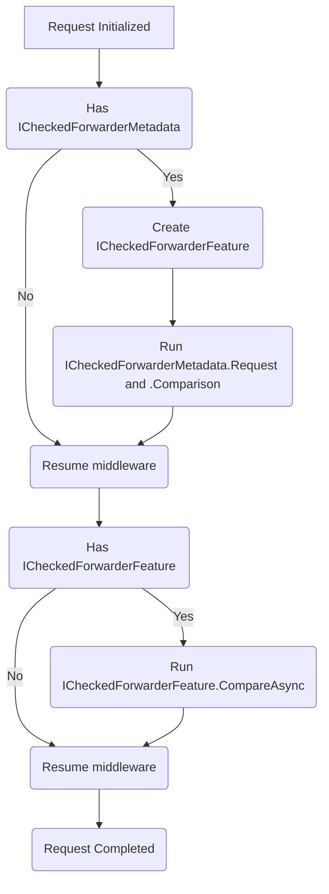

# Swick.YarpExtensions

These are a collection of extensions to facillitate migration with YARP using the [Strangler Fig Pattern](https://learn.microsoft.com/aspnet/core/migration/inc/overview).

## Checked Forwarder

[Sample](samples/CheckedForwarder/)

This is an extension that uses the `IHttpForwarder` to process a request both locally and remotely and provides a flexible comparison system. This enables testing in production of migrated endpoints to validate the request generated on the new ASP.NET Core application with the legacy ASP.NET Framework application.


Abstractions used:

- [ICheckedForwarderMetadata](src\Swick.YarpExtensions\Checked\ICheckedForwarderMetadata.cs)
- [ICheckedForwarderFeature](src\Swick.YarpExtensions\Features\ICheckedForwarderFeature.cs)

The general flow of this is as follows:



To use this, add the middleware and then register endpoints to be forwarded with a call to `.WithCheckedForwarder` as shown below:

```csharp

app.UseRouting();

// Additional middleware

// Query for ICheckedForwarderMetadata and add ICheckedForwarderFeature
app.UseCheckedForwarder();

// Additional middleware

app.Map("/", () => "Hello world!")
    // Add ICheckedForwarderMetadata
    .WithCheckedForwarder("http://localhost:5276", builder =>
    {
        // Build a pipeline of actions to initialize the forwarded request, as well as compare the requests

         // Add a check to short circuit forwarding
        builder.UseWhen(ctx => ValueTask.FromResult(true));
        
        // Verify status codes are the same
        builder.UseStatusCodes();

        // Verify headers - can customize what that means
        builder.UseHeaders(headers =>
        {
            headers.IgnoreDefault();
        });

        // Ensure response body is available via IMemoryResponseBodyFeature
        builder.UseResponseBuffering();

        // Compare forwarded and local body to ensure an exact byte-level match (will call .UseResponseBuffering() if not already called)
        builder.UseBody();

        // or supply a type and it will deserialize and use the default (or supplied) equality comparer (will call .UseResponseBuffering() if not already called)
        builder.UseJsonBody<SomeType>();
    });
```

This adds the feature `ICheckedForwarderFeature` that is used to track how to forward and compare. A couple usage guidelines:

- If you decide later in the pipeline not to run the forwarder and comparison, remove `ICheckedForwarderFeature` from the feature collection
- If you want to decide when to run the forwarder, call `ICheckedForwarderFeature.ForwardAsync()` at the appropriate time; otherwise, it will run after the main request is processed
- Body comparisons should use `IMemoryResponseBodyFeature` by enabling it either indirectly via one of the existing comparisons, or by manually calling `IContextComparerBuilder.UseResponseBuffering()`. Built in mechanisms are the following:
    - `UseBody`: Validates that it is equal at the byte level
    - `UseJsonBody<T>`: Deserializes a JSON payload for type `T` and uses the supplied comparer or the default one if none is given.
